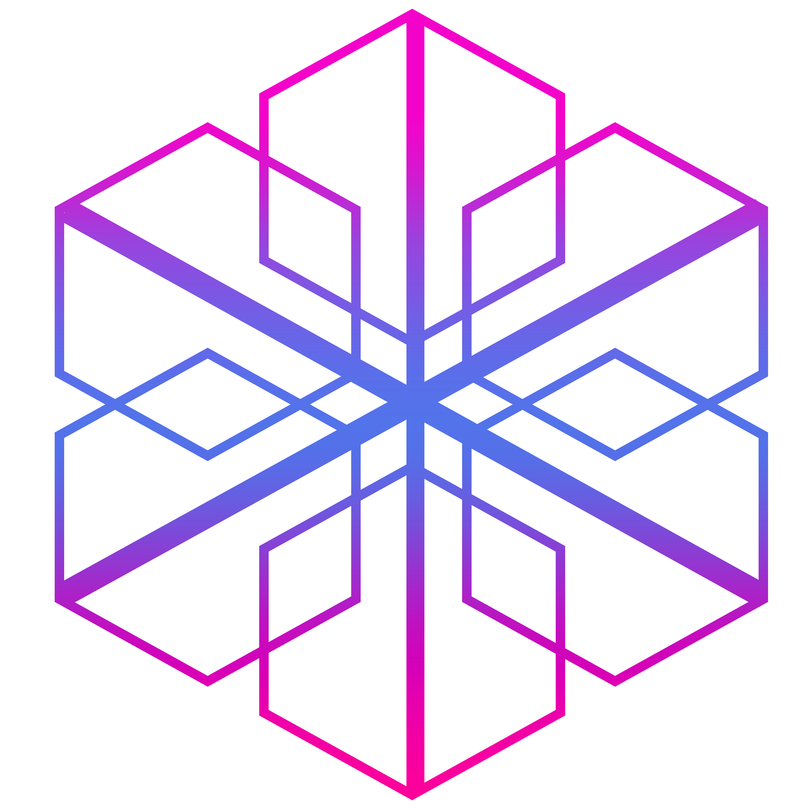

<link rel="stylesheet" href="./min24.css">

# <h1 class='d-in-block back-dmagenta p-15 orange radius-30'>24.CSS</h1> <span class='pl-20 f-size25 olive'>V.1.2.4</span>
## This is a <span class='orange'>CSS3</span> Library
-------
# Getting <span class='green'>Started</span> 
- [Why Use 24.css ?](#Why-Use-24css)
- [How To Use ?](#How-To-Use)
- [Features](#Features)
1. [Display](#Display)
2. [Flex Setting](#Flex-Setting)
    - [Justify Content](#Justify-Content)
    - [gap](#gap)
    - [Align Item](#Align-Item)
    - [Flex Direction](#Flex-Direction)
3. [Padding](#padding)
4. [Margin](#margin)
6. [Border Radius](#border-radius)
    - [Border None](#border-none)
7. [Text Align](#text-align)
8. [Text Decoration](#text-decoration)
8. [Font Size](#font-size)
9. [Width & Height](#width--height)
10. [User Zoom & User Select](#user-zoom--user-select)
11. [Cursor](#cursor-setting)
12. [Position](#position)
13. [Opacity](#opacity)
14. [Z-index](#z-index)
15. [Overflow](#overflow)
16. [colors](#color--backgroundcolor)
17. [more](#more)

# Why-Use-24.css?

1. Very Esey
2. Very Fast
3. Low Size
4. Very Simple to Use
5. It Reduces Your Code
6. and more...

# How-To-Use?

<p>Just add this CDN to HEAD of HTML project file <p>

```HTML
    <link rel="stylesheet" href="https://blokchainology.com/CDN/min24.css">
    <!--  or    -->
    <link rel="stylesheet" href="min24.css">
```

# Features

## Display

| Class Name         | In CSS                               |  Example                       |
|--------------------|:------------------------------------:|-------------------------------:|
| d-none             |    `css => display:none;`            | `<div class="d-none"><div>`    |
| d-flex             |    `css => display:flex;`            | `<div class="d-flex"><div>`    |
| d-block            |    `css => display:block;`           | `<div class="d-block"><div>`   |
| d-grid             |    `css => display:grid;`            | `<div class="d-grid"><div>`    |
| d-in-block         |    `css => display:inline-block;`    | `<div class="d-in-block"><div>`|
| d-in-flex          |    `css => display:inline-flex;`     | `<div class="d-in-flex"><div>` |
| d-in-grid          |    `css => display:inline-grid;`     | `<div class="d-in-grid"><div>` |

--------------------------------------------------------------------------------------------

## Flex-Setting


### Justify-Content
**You must have a display FLEX (d-flex) to use it**    

| Class Name         | In CSS                                   |  Example                                       |
|--------------------|:----------------------------------------:|-----------------------------------------------:|
| j-center           |  `css => justify-content: center;`       |  `<div class="d-flex j-center">Zmat24</div>`   |
| j-between          |  `css => justify-content: space-between;`|  `<div class="d-flex j-between">Zmat24</div>`  |
| j-around           |  `css => justify-content: space-around;` |  `<div class="d-flex j-around">Zmat24</div>`   |
| j-evenly           |  `css => justify-content: space-evenly;` |  `<div class="d-flex j-evenly">Zmat24</div>`   |
| j-fstart           |  `css => justify-content: flex-start;`   |  `<div class="d-flex j-fstart">Zmat24</div>`   |
| j-fend             |  `css => justify-content: flex-end;`     |  `<div class="d-flex j-fend">Zmat24</div>`     |
| j-right            |  `css => justify-content: right;`        |  `<div class="d-flex j-right">Zmat24</div>`    |
| j-left             |  `css => justify-content: left;`         |  `<div class="d-flex j-center">Zmat24</div>`   |
<br>
-----------------------------------------------------------------------------------------------------------

### gap
**You must have a display FLEX (d-flex) to use it**  

| Class Name         | In CSS                |  Example                                   |
|--------------------|:---------------------:|-------------------------------------------:|
| gap-5              |  `css => gap:5px;`    |  `<div class="d-flex gap-5">Zmat24</div>`  |
| gap-10             |  `css => gap:10px;`   |  `<div class="d-flex gap-10">Zmat24</div>` |
| gap-15             |  `css => gap:15px;`   |  `<div class="d-flex gap-15">Zmat24</div>` |
<br>
--------------------------------------------------------------------------------------

### Align-Item
**You must have a display FLEX (d-flex) to use it**    

| Class Name         | In CSS                                   |  Example                                           |
|--------------------|:----------------------------------------:|---------------------------------------------------:|
| align-item-c       |  `css => align-items:center;`            |  `<div class="d-flex align-item-c">Zmat24</div>`   |
| align-item-fs      |  `css => align-items:flex-start;`        |  `<div class="d-flex align-item-fs">Zmat24</div>`  |
| align-item-fe      |  `css => align-item:flex-end`           |  `<div class="d-flex align-item-fe">Zmat24</div>`  |
<br>
----------------------------------------------------------------------------------------------------------------

### Flex-Direction
**You must have a display FLEX (d-flex) to use it**    

| Class Name         | In CSS                                   |  Example                                           |
|--------------------|:----------------------------------------:|---------------------------------------------------:|
| f-dir-col          |  `css => flex-direction:column;`         |  `<div class="d-flex align-item-c">Zmat24</div>`   |
| f-dir-col-r        |  `css => flex-direction:column-reverse;` |  `<div class="d-flex align-item-fs">Zmat24</div>`  |
| f-dir-row          |  `css => flex-direction:row`             |  `<div class="d-flex align-item-fe">Zmat24</div>`  |
| f-dir-row-r        |  `css => flex-direction:row-reverse;`    |  `<div class="d-flex align-item-fe">Zmat24</div>`  |
<br>
----------------------------------------------------------------------------------------------------------------

## Padding
### 5 to 20 px (p-5 => 5px | p-10 => 10px | p-15 => 15px | p-20 => 20px) for every (top | bottom | left | right)

| Class Name         | In CSS                                   |  Example                           |
|--------------------|:----------------------------------------:|-----------------------------------:|
| p-5                |  `css => padding:5px;`                   |  `<div class="p-5">Zmat24</div>`   |
| pt-5               |  `css => padding-top:5px;`               |  `<div class="pt-5">Zmat24</div>`  |
| pb-5               |  `css => padding-bottom:5px;`            |  `<div class="pb-5">Zmat24</div>`  |
| pl-5               |  `css => padding-left:5px;`              |  `<div class="pl-5">Zmat24</div>`  |
| pr-5               |  `css => padding-right:5px;`             |  `<div class="pr-5">Zmat24</div>`  |


| Class Name         | In CSS                                   |  Example                           |
|--------------------|:----------------------------------------:|-----------------------------------:|
| p-10               |  `css => padding:10px;`                  |  `<div class="p-10">Zmat24</div>`  |
| pt-10              |  `css => padding-top:10px;`              |  `<div class="pt-10">Zmat24</div>` |
| pb-10              |  `css => padding-bottom:10px;`           |  `<div class="pb-10">Zmat24</div>` |
| pl-10              |  `css => padding-left:10px;`             |  `<div class="pl-10">Zmat24</div>` |
| pr-10              |  `css => padding-right:10px;`            |  `<div class="pr-10">Zmat24</div>` |


| Class Name         | In CSS                                   |  Example                           |
|--------------------|:----------------------------------------:|-----------------------------------:|
| p-15               |  `css => padding:15px;`                  |  `<div class="p-15">Zmat24</div>`  |
| pt-15              |  `css => padding-top:15px;`              |  `<div class="pt-15">Zmat24</div>` |
| pb-15              |  `css => padding-bottom:15px;`           |  `<div class="pb-15">Zmat24</div>` |
| pl-15              |  `css => padding-left:15px;`             |  `<div class="pl-15">Zmat24</div>` |
| pr-15              |  `css => padding-right:15px;`            |  `<div class="pr-15">Zmat24</div>` |


| Class Name         | In CSS                                   |  Example                           |
|--------------------|:----------------------------------------:|-----------------------------------:|
| p-20               |  `css => padding:20px;`                  |  `<div class="p-20">Zmat24</div>`  |
| pt-20              |  `css => padding-top:20px;`              |  `<div class="pt-20">Zmat24</div>` |
| pb-20              |  `css => padding-bottom:20px;`           |  `<div class="pb-20">Zmat24</div>` |
| pl-20              |  `css => padding-left:20px;`             |  `<div class="pl-20">Zmat24</div>` |
| pr-20              |  `css => padding-right:20px;`            |  `<div class="pr-20">Zmat24</div>` |

----------------------------------------------------------------------------------------------------------------

## Margin
### 5 to 20 px (m-5 => 5px | m-10 => 10px | m-15 => 15px | m-20 => 20px) for every (top | bottom | left | right)

| Class Name         | In CSS                                  |  Example                           |
|--------------------|:---------------------------------------:|-----------------------------------:|
| m-5                |  `css => margin:5px;`                   |  `<div class="m-5">Zmat24</div>`   |
| mt-5               |  `css => margin-top:5px;`               |  `<div class="mt-5">Zmat24</div>`  |
| mb-5               |  `css => margin-bottom:5px;`            |  `<div class="mb-5">Zmat24</div>`  |
| ml-5               |  `css => margin-left:5px;`              |  `<div class="ml-5">Zmat24</div>`  |
| mr-5               |  `css => margin-right:5px;`             |  `<div class="mr-5">Zmat24</div>`  |


| Class Name          | In CSS                                   |  Example                            |
|---------------------|:----------------------------------------:|------------------------------------:|
| m-10                |  `css => margin:10px;`                   |  `<div class="m-10">Zmat24</div>`   |
| mt-10               |  `css => margin-top:10px;`               |  `<div class="mt-10">Zmat24</div>`  |
| mb-10               |  `css => margin-bottom:10px;`            |  `<div class="mb-10">Zmat24</div>`  |
| ml-10               |  `css => margin-left:10px;`              |  `<div class="ml-10">Zmat24</div>`  |
| mr-10               |  `css => margin-right:10px;`             |  `<div class="mr-10">Zmat24</div>`  |


| Class Name          | In CSS                                   |  Example                            |
|---------------------|:----------------------------------------:|------------------------------------:|
| m-15                |  `css => margin:15px;`                   |  `<div class="m-15">Zmat24</div>`   |
| mt-15               |  `css => margin-top:15px;`               |  `<div class="mt-15">Zmat24</div>`  |
| mb-15               |  `css => margin-bottom:15px;`            |  `<div class="mb-15">Zmat24</div>`  |
| ml-15               |  `css => margin-left:15px;`              |  `<div class="ml-15">Zmat24</div>`  |
| mr-15               |  `css => margin-right:15px;`             |  `<div class="mr-15">Zmat24</div>`  |


| Class Name          | In CSS                                   |  Example                            |
|---------------------|:----------------------------------------:|------------------------------------:|
| m-20                |  `css => margin:20px;`                   |  `<div class="m-20">Zmat24</div>`   |
| mt-20               |  `css => margin-top:20px;`               |  `<div class="mt-20">Zmat24</div>`  |
| mb-20               |  `css => margin-bottom:20px;`            |  `<div class="mb-20">Zmat24</div>`  |
| ml-20               |  `css => margin-left:20px;`              |  `<div class="ml-20">Zmat24</div>`  |
| mr-20               |  `css => margin-right:20px;`             |  `<div class="mr-20">Zmat24</div>`  |
<br>

----------------------------------------------------------------------------------------------------

## Border-Radius

### border radius (5 to 30 px & 10% , 20% , 30% , 50% || -- => %)
  
| Class Name   | In CSS                            |  Example                                 | Result                       |
|--------------|:---------------------------------:|-----------------------------------------:|:----------------------------:|
| radius-5     |  `css => border-radius:5px;`      |  `<button class="radius-5">24<button>`   | <button class="radius-5">24  |
| radius-10    |  `css => border-radius:10px;`     |  `<button class="radius-10">24<button>`  | <button class="radius-10">24 |
| radius-15    |  `css => border-radius:15px;`     |  `<button class="radius-15">24<button>`  | <button class="radius-15">24 |
| radius-20    |  `css => border-radius:20px;`     |  `<button class="radius-20">24<button>`  | <button class="radius-20">24 |
| radius-25    |  `css => border-radius:25px;`     |  `<button class="radius-25">24<button>`  | <button class="radius-25">24 |
| radius-30    |  `css => border-radius:30px;`     |  `<button class="radius-30">24<button>`  | <button class="radius-30">24 |
| radius--50   |  `css => border-radius:50%;`      |  `<button class="radius--50">24<button>` | <button class="radius--50">24|
| radius--30   |  `css => border-radius:30%;`      |  `<button class="radius--30 ">24<button>`| <button class="radius--30">24|
| radius--20   |  `css => border-radius:20%;`      |  `<button class="radius--20 ">24<button>`| <button class="radius--20">24|
| radius--10   |  `css => border-radius:10%;`      |  `<button class="radius--10 ">24<button>`| <button class="radius--10">24|

----------------------------------------------------------------------------------------------------

##  Border-none 

| Class Name    | In CSS                  |  Example                    | Result                                             |
|---------------|:-----------------------:|----------------------------:|:--------------------------------------------------:|
| border-n      |  `css => border:none;`  |  `<input class="border-n">` | <input placeholder="border-none" class="border-n"> |

<br>
----------------------------------------------------------------------------------------------------

## Text-Align

| Class Name      | In CSS                        |  Example                                    |
|-----------------|:-----------------------------:|--------------------------------------------:|
| t-align-center  |  `css => text-align:center;`  |  `<div class="t-align-center">Zmat24</div>` |
| t-align-left    |  `css => text-align:right;`   |  `<div class="t-align-left">Zmat24</div>`   |
| t-align-right   |  `css => text-align:right;`   |  `<div class="t-align-right">Zmat24</div>`  |
<br>
----------------------------------------------------------------------------------------------------

## Text-Decoration

| Class Name     | In CSS                             |  Example                                    |  Result                                  |
|:--------------:|:----------------------------------:|--------------------------------------------:|:----------------------------------------:|
| txt-dec-n      |  `css => text-decoration:none;`    |  `<p class='txt-dec-n'>Hello Zmat24</p>`    | <p class='txt-dec-n'>Hello Zmat24</p>    |
| txt-dec-dot    |  `css => text-decoration:dotted  ` |  `<p class='txt-dec-dot'>Hello Zmat24</p>`  | <p class='txt-dec-dot'>Hello Zmat24</p>  |
| t-xt-dec-uline |  `css => text-decoration:underline`|  `<p class='txt-dec-uline'>Hello Zmat24</p>`| <p class='txt-dec-uline'>Hello Zmat24</p>|
| t-xt-dec-dash  |  `css => text-decoration:dashed`   |  `<p class='txt-dec-dash'>Hello Zmat24</p>` | <p class='txt-dec-dash'>Hello Zmat24</p> |
<br>
----------------------------------------------------------------------------------------------------

## Font-Size

| Class Name      | In CSS                      |  Example                             | Result                             |
|-----------------|:---------------------------:|-------------------------------------:|:----------------------------------:|
| f-size15        |  `css => font-size:15px;`   |  `<p class="f-size15">Zmat24</p>`    | <p class="f-size15">Zmat24</p>     |
| f-size20        |  `css => font-size:20px;`   |  `<p class="f-size20">Zmat24</p>`    | <p class="f-size20">Zmat24</p>     |
| f-size25        |  `css => font-size:25px;`   |  `<p class="f-size25">Zmat24</p>`    | <p class="f-size25">Zmat24</p>     |
| f-size30        |  `css => font-size:30px;`   |  `<p class="f-size30">Zmat24</p>`    | <p class="f-size30">Zmat24</p>     |
| f-size35        |  `css => font-size:35px;`   |  `<p class="f-size35">Zmat24</p>`    | <p class="f-size35">Zmat24</p>     |


-----------------------------------------------------------------------------------------------------

## Width-&-Height
### In 24.css All Width and Height are based on percentages (%)

| Class Name | In CSS                 |  Example                              |
|------------|:----------------------:|--------------------------------------:|
| w--25      |  `css => width:25%;`   |  `<div class="w--25">Zmat24</div>`    |
| w--50      |  `css => width:50%;`   |  `<div class="w--50">Zmat24</div>`    |
| w--75      |  `css => width:75%;`   |  `<div class="w--75">Zmat24</div>`    |
| w--100     |  `css => width:100%;`  |  `<div class="w--100">Zmat24</div>`   |
| h--25      |  `css => height:25%;`  |  `<div class="h-25">Zmat24</div>`     |
| h--50      |  `css => height:50%;`  |  `<div class="h-50">Zmat24</div>`     |
| h--75      |  `css => height:75%;`  |  `<div class="h-75">Zmat24</div>`     |
| h--100     |  `css => height:100%;` |  `<div class="h-100">Zmat24</div>`    |

----------------------------------------------------------------------------------------------------

## User-Zoom-&-User-Select

| Class Name  | In CSS                      |  Example                             |
|-------------|:---------------------------:|-------------------------------------:|
| zoom-off    |  `css => user-zoom:none;`  |  `<body class="zoom-off"></body>`    |
| select-off  |  `css => user-select:none;` |  `<body class="select-off"></body>`  |


-----------------------------------------------------------------------------------------------------

## Cursor-Setting
### Custom User Cursor

| Class Name  | In CSS                      |  Example                                      |  Result                           |
|-------------|:---------------------------:|----------------------------------------------:|:---------------------------------:|
| cursor-p    |  `css => cursor:pointer;`   |  `<button class="cursor-p">Zmat24</button>`   | <button class="cursor-p">Zmat24   |
| cursor-a    |  `css => cursor:auto;`      |  `<button class="cursor-a">Zmat24</button>`   | <button class="cursor-a">Zmat24   |
| cursor-d    |  `css => cursor:defult;`    |  `<button class="cursor-d">Zmat24</button>`   | <button class="cursor-d">Zmat24   |
| cursor-off  |  `css => cursor:none;`      |  `<button class="cursor-off">Zmat24</button>` | <button class="cursor-off">Zmat24 |

---------------------------------------------------------------------------------------------------

## Position

| Class Name      | In CSS                          |  Example                                   |
|:---------------:|:-------------------------------:|:------------------------------------------:|
| position-ab     |  `css => position:absolute;`    |  `<div class="position-ab">Zmat24</div>`   |
| position-fix    |  `css => position:fixed; `      |  `<div class="position-fix">Zmat24</div>`  |
| position-rel    |  `css => position:relative;`    |  `<div class="position-rel">Zmat24</div>`  |
| position-st     |  `css => position:static;`      |  `<div class="position-st">Zmat24</div>`   |

--------------------------------------------------------------------------------------------------

## Opacity


| Class Name  | In CSS                    |  Example                       | Result                                             |
|:-----------:|:-------------------------:|:------------------------------:|:--------------------------------------------------:|
| opc-0       |  `css => opacity:0;`      |  ``  |  |
| opc-1       |  `css => opacity:0.1;`    |  ``  |  |
| opc-2       |  `css => opacity:0.2;`    |  ``  |  |
| opc-3       |  `css => opacity:0.3;`    |  ``  |  |
| opc-4       |  `css => opacity:0.4;`    |  ``  |  |
| opc-5       |  `css => opacity:0.5;`    |  ``  |  |
| opc-6       |  `css => opacity:0.6;`    |  ``  |  |
| opc-7       |  `css => opacity:0.7;`    |  ``  |  |
| opc-8       |  `css => opacity:0.8;`    |  ``  |  |
| opc-9       |  `css => opacity:0.9;`    |  ``  |  |
| opc-10      |  `css => opacity:1;`      |  `` | |
--------------------------------------------------------------------------------------------------

## Z-index


| Class Name | In CSS                    |  Example                       |
|:----------:|:-------------------------:|:------------------------------:|
| z-1        |  `css => z-index:0;`      |  ` z-index:0.1;`    |  ``    |
| z-3        |  `css => z-index:0.2;`    |  ``    |
| z-24       |  `css => z-index:0.3;`    |  ``   |
| z-999      |  `css => z-index:0.4;`    |  ``  |
| z--1       |  `css => z-index:0.5;`    |  ``   |
| z--2       |  `css => z-index:0.6;`    |  ``   |
| z--3       |  `css => z-index:0.7;`    |  ``   |
| z--24      |  `css => z-index:0.8;`    |  ``  |
| z--999     |  `css => z-index:0.9;`    |  `` |

--------------------------------------------------------------------------------------------

## Overflow


| Class Name     | In CSS                         |  Example                               |
|:--------------:|:------------------------------:|:--------------------------------------:|
| over-hidden    |  `css => overflow: hidden;`    |  ` overflow-y: hidden;`  |  ``  |
| over-x-hidden  |  `overflow-x: hidden;`         |  ``  |
| over-auto      |  `css => overflow: auto;`      |  ``      |
| over-y-auto    |  `overflow-y: auto;`           |  ``    |
| over-x-auto    |  `overflow-x: auto;`           |  ``     |
| over-scroll    |  `css => overflow: scroll;`    |  ``    |
| over-y-scroll  |  `css => overflow-y: scroll;`  |  ``  |
| over-x-scroll  |  `css => overflow-x: scroll;`  |  ``  |

--------------------------------------------------------------------------------------------


## Color-&-backgroundcolor

### For Use Color and Background color Just add this class name for ```ELEMENT```
### Background Color => {
    back-red 
    back-green
    back-blue
    back-black
    back-brown
    back-yellow
    back-gray
    back-tan
    back-purple
    back-pink
    back-olive
    back-cadetblue
    back-cyan
    back-dmagenta

### }

### Color {
    white
    red
    green
    blue
    black
    brown
    yellow
    gray
    tan
    purple
    pink
    olive
    cadetblue
    cyan
    dmagenta
### }

## more
<p>More options :) </p>

| Class Name    | In CSS                        |  Example                                   |
|---------------|:-----------------------------:|-------------------------------------------:|
| list-n        |  `css => list-style:none;`    |  `<ul class="list-n"></ul>`                |


THE END.

[Blokchainology.com](https://blokchainology.com)<br>
[Matin soleymani](https://blokchainology.com/team/matinsoleymani)

# Make With LOVE For Developers 🦾🤍
ZMAT24<br>
Matin soleymani
